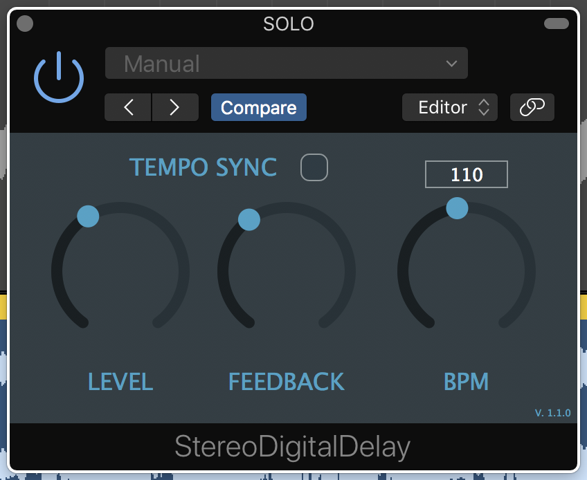

# STEREO DIGITAL DELAY 

## Simple Stereo Delay Plugin, made with JUCE Framework by ROLI. 

Make sure to have installed the VST3 SDK by Steinberg in order to compile the VST3 version of this plugin, without it you can create only the VST version and (if you're on macOS) the AU one.

You can download the SDK from here: https://www.steinberg.net/en/company/developers.html

### Version 1.0.3 --> Now you can save the plugin state when you close your DAW

### Version 1.0.2 --> Minor improvements

### Version 1.0.1 --> First version!

## 

